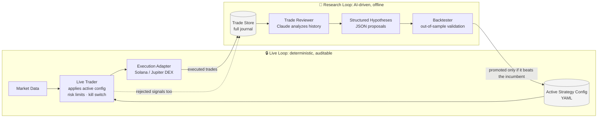

# alpha-loop

**An AI-assisted algorithmic trading system that keeps the machine that decides separate from the machine that learns.**

> **Disclaimer.** Research and engineering project. Nothing here is financial advice or a solicitation to trade. Algorithmic trading of crypto assets carries substantial risk of loss. Provided as-is, with no warranty. This is a **public shell** of a larger private system. See [What's in this repository](#whats-in-this-repository).

Most "AI trading bot" projects let a model make live decisions directly. That is unsafe, and it is unbacktestable. alpha-loop starts from the opposite premise. **Execution is deterministic and auditable. Learning happens offline, on evidence, and has to prove itself before it touches production.**

It runs as two loops:

- **The live loop** is deterministic. Given the same market data and config, it makes the same decision every time. Rules, risk limits, and a hard kill switch. No model in the hot path.
- **The research loop** is where the AI lives. Claude analyzes logged trade history, identifies patterns, and proposes strategy changes as structured hypotheses. Nothing a model suggests reaches the live loop until it has been backtested and shown to be an improvement.

Every decision is explainable. Every proposed change is evidence-gated.



The live loop never calls an LLM. The research loop never touches live money. The only thing that crosses between them is a backtested, evidence-gated config change.

---

## Why it's built this way

A few design decisions carry the whole system:

**Deterministic execution, AI-gated evolution.** The live trader never calls an LLM. It reads a config-defined strategy and applies it mechanically. The LLM does research. It proposes the next config. It does not trade. That split is what makes the system both safe and improvable.

**Everything is journaled, including the trades that didn't happen.** Rejected signals are logged alongside executed ones, each with a structured rejection reason. You can't learn why a strategy underperforms if you only keep the trades it took. The near-misses are the signal. The research loop reads the full journal.

**Hypotheses are structured, not prose.** Claude returns strategy proposals as structured JSON (parameters, rationale, expected effect), which flow straight into the backtester. A proposal that doesn't beat the incumbent on out-of-sample data is discarded automatically. No human cherry-picking.

**Config-driven strategies.** Strategies are declarative YAML and swappable. The same engine runs a breakout rule or a momentum rule without code changes. New signal logic drops in as a plugin.

---

## Architecture

Hexagonal (ports & adapters). The domain and application layers never touch an external system directly. Every integration (market data, execution venue, LLM, storage) sits behind a port and is implemented by a swappable adapter. That is what lets the same strategy logic run against a backtest, a paper feed, or a live DEX unchanged.

```
alpha_loop/
  domain/          entities, value objects, trading rules, pure services  (no external deps)
  application/     use cases + orchestrators (the two loops live here)
  ports/           execution · market_data · trade_store · llm  (abstract interfaces)
  adapters/        execution · market_data · persistence · analytics · llm  (concrete)
  apps/            data_collector · feature_pipeline · backtester ·
                   live_trader · trade_reviewer · position_replayer
  configs/         live/ · backtest/ · strategies/   (declarative strategy defs)
  prompts/         regime_analysis · strategy_proposals · trade_review
  plugins/         pluggable signal strategies
```

**The apps map to the loops:**
- **Data:** `data_collector` → `feature_pipeline` build the market dataset.
- **Live loop:** `live_trader` executes the active config through the execution adapter.
- **Research loop:** `trade_reviewer` (Claude reads the journal) → strategy proposals → `backtester` validates. Only winners get promoted.
- **Debugging:** `position_replayer` reconstructs any historical position for post-mortem.

---

## What's in this repository

This is a **public shell**. It shows the engineering: the two-loop architecture, the hexagonal structure, the journaling discipline, and the research-loop prompt design. It does not publish a working trading edge.

**Included (the real architecture):**
- The full hexagonal skeleton: `domain/`, `application/`, `ports/`, `adapters/`, `apps/`.
- The live-loop decision flow: `StrategyEngine.evaluate()`, the filter chain, ATR-based stop placement, and the signal/rejection journaling contract (`domain/services/strategy_engine.py`).
- The risk envelope: per-trade risk sizing, a hard position-size cap, daily-drawdown halt, and liquidity floors (`domain/services/risk_engine.py`).
- The research loop end to end: deterministic session metrics (`domain/services/review_engine.py`) feeding the structured-JSON hypothesis contract and Claude integration (`adapters/llm/anthropic_adapter.py`).
- Execution and data adapters (Jupiter DEX, Birdeye), persistence, and the config loader.

**Withheld (kept private):**
- The concrete **setup-detection internals**, meaning the exact conditions that define a tradeable pattern. The `_detect_*` methods are stubbed with `NotImplementedError` and clearly marked.
- The **production-tuned strategy and session configs**. Only illustrative `example_strategy.yaml` and `example_session.yaml` are included. Every parameter default in the code is a documented placeholder, not a recommended value.
- Collected market data and the generated research hypotheses.

Because the detection internals are stubbed, this shell is for reading, not for live trading. It will not generate signals as published.

---

## Tech stack

`Python 3.12` · hexagonal architecture · `PostgreSQL` (+ `asyncpg`, SQLAlchemy async, Alembic) · `Parquet`/`pyarrow` for market data · `Pydantic` · `Anthropic Claude` · `Typer` CLI · Solana/Jupiter DEX execution adapter.

---

## Status

Research project, actively developed. The engine, journaling, backtester, and research loop are in place and run on collected market data. Live execution is gated behind explicit risk controls and is **not** running unattended.

**Roadmap:** regime-aware strategy selection · expand the plugin signal library · richer post-mortem tooling.
